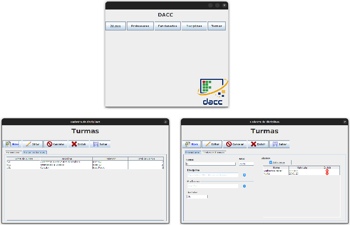
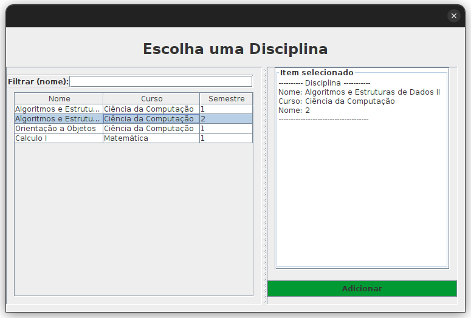

# ProjetoDacc_JPA: Java Swing Application

Este projeto final da disciplina LABORATORIO DE PROGRAMAÇÃO DE SISTEMA
- Faz uso completo de JPA-Hibernate

## Novidades e Melhorias
- Integração com o **Maven** para gerenciamento de dependências.
- Estruturação refinada da arquitetura.
- Banco de dados Mysql
- Adoção do framework JPA-Hibernate.
- @OneToMany
- @ManyToMany
- Cadastro de Turmas:
  - Aqui sim fica interessante, pois temos um domínio bem recheado de outras classes
  - Assim podemos explorar @ManyToMany, trocar o fetch EAGER de uma lista entre outra coisas mais realistas
  - Também é possivel ver como se colocar uma IMAGEM dentro de uma AbstractTableModel deixando seu sistema mais interessante
  
  - Também pode ser observada como fizemos a seleção de professores e alunos
<p align="center">
  
</p>

## Gerenciamento de Dependências com Maven
- Utilizamos o Maven como gerenciador de dependências do projeto. 
- As dependências estão especificadas no arquivo `POM.xml`.
- Se precisar adicionar novas dependências, consulte o [repositório central Maven](https://search.maven.org/) ou o [mvnrepository](https://mvnrepository.com/).

## Padrão MVC
O padrão MVC foi adotado, o que permite uma clara separação entre as camadas VIEW e CONTROLLER. Esta estruturação garante que essas camadas permaneçam consistentes, independentemente das abordagens utilizadas na camada MODEL.

## Padrão Factory
Estamos utilizando o padrão Factory para a criação do `EntityManager` do Hibernate.

## Conceitos OOP
Os conceitos de Herança, Interface e Polimorfismo estão presentes na camada MODEL, especificamente no DAO. Isso evidencia como uma camada MODEL bem estruturada mantém as camadas VIEW e CONTROLLER consistentes e desacopladas.

## Hibernate e MySQL
- O Hibernate está configurado especificamente para a classe "Funcionário".
- Este é um exemplo puramente didático.
- **Atenção**:
  - Estamos utilizando o banco de dados MySQL. Se você deseja executar esta parte do projeto, certifique-se de ter o MySQL instalado e configurado em sua máquina.
  - Crie um banco de dados chamado 'db001'. O JPA-Hibernate cuidará da criação das tabelas necessárias.
  - Se desejar alterar o nome do banco de dados, modifique o arquivo `persistence.xml`.

```xml
<?xml version="1.0" encoding="UTF-8"?>
<persistence version="2.1" xmlns="http://xmlns.jcp.org/xml/ns/persistence" xmlns:xsi="http://www.w3.org/2001/XMLSchema-instance" xsi:schemaLocation="http://xmlns.jcp.org/xml/ns/persistence     http://xmlns.jcp.org/xml/ns/persistence/persistence_2_1.xsd">
  <persistence-unit name="exemplo-jpa" transaction-type="RESOURCE_LOCAL">
    <properties>
      <property name="javax.persistence.jdbc.url" value="jdbc:mysql://localhost/db0001?useSSL=false&amp;serverTimezone=UTC"/>
      <property name="javax.persistence.jdbc.driver" value="com.mysql.jdbc.Driver"/>
      <property name="javax.persistence.jdbc.user" value="root"/>
      <property name="javax.persistence.jdbc.password" value="password"/>
      <property name="hibernate.hbm2ddl.auto" value="update"/>
      <!-- https://docs.jboss.org/hibernate/orm/5.4/javadocs/org/hibernate/dialect/package-summary.html -->
      <property name="hibernate.dialect" value="org.hibernate.dialect.MySQL8Dialect"/>
      
      <property name="hibernate.format_sql" value="true"/>
      <property name="hibernate.show_sql" value="true"/>
      
    </properties>
  </persistence-unit>
</persistence>
```

## Conclusão
Esperamos que este projeto sirva como uma referência valiosa para seus estudos e desenvolvimento em Java Swing com integração ao JPA-Hibernate. Qualquer feedback ou contribuição é muito bem-vindo!


